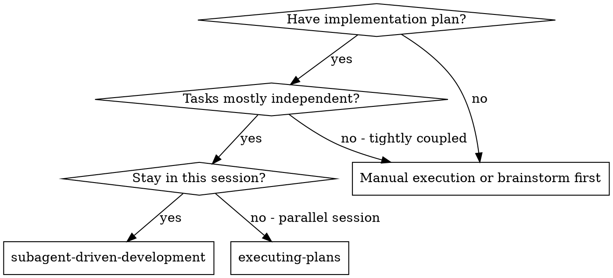
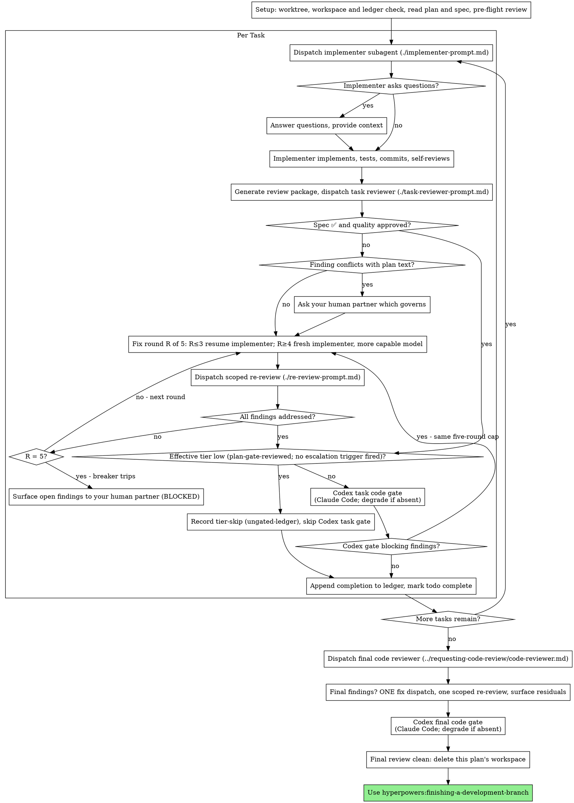

# Subagent-Driven Development

Execute plan by dispatching a fresh implementer subagent per task, a task review (spec compliance + code quality) after each, and a broad whole-branch review at the end.

**Why subagents:** You delegate tasks to specialized agents with isolated context. By precisely crafting their instructions and context, you ensure they stay focused and succeed at their task. They should never inherit your session's context or history — you construct exactly what they need. This also preserves your own context for coordination work.

**Core principle:** Fresh subagent per task + task review (spec + quality) + broad final review = high quality, fast iteration

**Narration:** between tool calls, narrate at most one short line — the
ledger and the tool results carry the record.

**Continuous execution:** Do not pause to check in with your human partner between tasks. Execute all tasks from the plan without stopping. The only reasons to stop are: BLOCKED status you cannot resolve, ambiguity that genuinely prevents progress, or all tasks complete. "Should I continue?" prompts and progress summaries waste their time — they asked you to execute the plan, so execute it.

## When to Use



**vs. Executing Plans (parallel session):**
- Same session (no context switch)
- Fresh subagent per task (no context pollution)
- Review after each task (spec compliance + code quality), broad review at the end
- Faster iteration (no human-in-loop between tasks)

## The Process



## Setup

Ensure the work happens in an isolated workspace: use
hyperpowers:using-git-worktrees to create one or verify the existing one.
Never start implementation on a main/master branch without your human
partner's explicit consent.

Conversation memory does not survive compaction. In real sessions,
controllers that lost their place have re-dispatched entire completed task
sequences — the single most expensive failure observed. Track progress in
a ledger file, not only in todos.

- Each plan owns a workspace: at skill start, run this skill's
  `scripts/sdd-dir PLAN_FILE` — it prints the plan's scratch directory
  under the user cache
  (`${XDG_CACHE_HOME:-~/.cache}/hyperpowers/sdd/<per-repo-key>/plans/<plan-slug>-<hash8>/`),
  home to every artifact for THIS plan: ledger, briefs, reports, review
  packages, tier-skip summary. The cache is off any protected path, so
  writing there never triggers a permission prompt, and it is outside the
  working tree, so it can never be committed. Another plan's directory is
  never yours to read or write.
- Check for this plan's ledger at `<workspace>/progress.md` — this plan's
  workspace only, never a sibling's. If its first line names your plan
  file, tasks with a `Task <N>: complete` line are DONE — do not
  re-dispatch them; resume at the first task without one. A task whose last
  line is a fix round is mid-loop: resume the loop at the next round. A
  ledger whose first line names a different plan file is another plan's
  progress: leave it in place and start your own, fresh.
- Create the ledger with its identity as the first line:
  `# SDD ledger — plan: <plan file path>`.
- The ledger is your recovery map: the commits it names exist in git even
  when your context no longer remembers creating them. After compaction,
  trust the ledger and `git log` over your own recollection.
- The workspace is scratch, not a deliverable. The Finish step deletes it
  once the final whole-branch review is clean; `scripts/sdd-dir` also
  reclaims sibling workspaces idle for 14+ days as a backstop for sessions
  that never reach Finish. It never reclaims the workspace you are using —
  every call refreshes it — so a resumed session always finds its ledger.

Read the plan once, note its context and Global Constraints, and create a
todo per task. Read the plan's `**Spec:**` header and the spec file it
names: the spec is the binding authority the plan argues from, and
conflicts inside the plan resolve against it. A plan whose spec is `none`
or unreachable gets a ledger line saying so — without a spec, a conflict
has no tiebreaker but your human partner.

Before dispatching Task 1, scan the plan once for conflicts, writing down
what you checked as you check it:

- tasks that contradict each other or the plan's Global Constraints
- anything the plan explicitly mandates that the review rubric treats as a
  defect (a test that asserts nothing, verbatim duplication of a logic block)

The scan's output is a table, not a verdict. One row for every pair of tasks
that share a file or an interface: the two tasks, what one produces against
what the other consumes, and what you found. One row for every task: whether
its own text agrees with itself — the tests it specifies against the code it
specifies, the files it creates against the files it later touches. "The scan
is clean" without those rows is not a scan you ran.

Write the table to the ledger. Then present everything it surfaced to your
human partner as ONE batched question — each finding beside the plan text
that mandates it, asking which governs — before execution begins, not one
interrupt per discovery mid-plan. If the scan is clean, proceed without
comment. The review loop remains the net for conflicts that only emerge
from implementation.

## Model Selection

Use the least powerful model that can handle each role to conserve cost and increase speed.

**Mechanical implementation tasks** (isolated functions, clear specs, 1-2 files): use a fast, cheap model. Most implementation tasks are mechanical when the plan is well-specified.

**Integration and judgment tasks** (multi-file coordination, pattern matching, debugging): use a standard model.

**Architecture and design tasks**: use the most capable available model.
The final whole-branch review is one of these — dispatch it on the most
capable available model, not the session default.

**Review tasks**: choose the model with the same judgment, scaled to the
diff's size, complexity, and risk. A small mechanical diff does not need the
most capable model; a subtle concurrency change does. Scoped re-reviews of
small fix diffs take a cheap-to-mid tier.

**Fix-loop escalation (rounds 4-5)**: use a model at least one tier above
the implementer that got stuck.

**Always specify the model explicitly when dispatching a subagent.** An
omitted model inherits your session's model — often the most capable and
most expensive — which silently defeats this section.

**Turn count beats token price.** Wall-clock and context cost scale with how
many turns a subagent takes, and the cheapest models routinely take 2-3× the
turns on multi-step work — costing more overall. Use a mid-tier model as the
floor for reviewers and for implementers working from prose descriptions.
When the task's plan text contains the complete code to write, the
implementation is transcription plus testing: use the cheapest tier for
that implementer. Single-file mechanical fixes also take the cheapest tier.

**Task complexity signals (implementation tasks):**
- Touches 1-2 files with a complete spec → cheap model
- Touches multiple files with integration concerns → standard model
- Requires design judgment or broad codebase understanding → most capable model

## The Task Loop

**Batch small same-shape work.** When the plan lists several tasks that are
each a small, independent edit of the same kind — the same one-line fix,
constant change, or field addition repeated across files — do not dispatch
one subagent per task. Compose ONE dispatch brief listing every file and
its change, send the whole batch to a single subagent, and review its diff
as one unit. Reserve one-dispatch-per-task for work that needs its own
judgment, its own tests, or its own review surface.
A batch's effective risk tier for the per-task Codex gate is the MAX of the
batched tasks' declared tiers — batching low-tier tasks never manufactures
a gate skip.

Everything you paste into a dispatch prompt — and everything a subagent
prints back — stays resident in your context for the rest of the session
and is re-read on every later turn. Hand artifacts over as files.

**Waiting on dispatched subagents:** never poll a wait interface with
short timeouts, and never sit in one silent, open-ended wait either.
While you have local work — ledger updates, packaging the next review,
reading reports — keep working; child results arrive on their own.
When you are genuinely idle, wait in bounded stretches (five to ten
minutes, where your platform allows), and between stretches post one
line of status and reconcile your live children: list them, and chase
any that finished without reporting. A bounded stretch keeps nearly
all of a long wait's efficiency while guaranteeing a stuck or lost
child is noticed within minutes, not at the end of the session.

### 1. Dispatch the implementer

Record BASE (`git rev-parse HEAD`) before dispatching — the review package
and fix-round diffs need it.

- **Task brief:** before dispatching an implementer, run this skill's
  `scripts/task-brief PLAN_FILE N` — it extracts the task's full text to a
  uniquely named file and prints the path. Compose the dispatch so the
  brief stays the single source of
  requirements. Your dispatch should contain: (1) one line on where this
  task fits in the project; (2) the brief path, introduced as "read this
  first — it is your requirements, with the exact values to use verbatim";
  (3) interfaces and decisions from earlier tasks that the brief cannot
  know; (4) your resolution of any ambiguity you noticed in the brief;
  (5) the report-file path and report contract. Exact values (numbers,
  magic strings, signatures, test cases) appear only in the brief. Never
  make a subagent read the whole plan file.
- **Report file:** name the implementer's report file after the brief
  (brief `…/task-N-brief.md` → report `…/task-N-report.md`) and put it in
  the dispatch prompt. The implementer writes the full report there and
  returns only status, commits, a one-line test summary, and concerns.
- A dispatch prompt describes one task, not the session's history. Do not
  paste accumulated prior-task summaries ("state after Tasks 1-3") into
  later dispatches — a real session's dispatch hit 42k chars of which 99%
  was pasted history. A fresh subagent needs its task, the interfaces it
  touches, and the global constraints. Nothing else.
- The dispatch carries the no-subagents contract (it is in the
  implementer template): the implementer never dispatches subagents —
  not helpers, and never a reviewer. Review arrives from you, after the
  report. In real sessions, every reviewer a worker spawned duplicated
  the task review the controller dispatched anyway — a full extra
  review seat per task.
- Subagents follow hyperpowers:test-driven-development for the task's tests.
- If an earlier task deferred a finding in the area this task touches — a
  Minor in the ledger, or one your human partner decided — carry a pointer
  to that ledger entry in the dispatch.
- Record the implementer's agent identity from the dispatch result —
  fix-loop rounds 1-3 resume this agent.
- Never dispatch multiple implementation subagents in parallel (conflicts).

Template: [implementer-prompt.md](implementer-prompt.md)

### 2. Handle the report

**Subagent Reports Are Claims.** Subagent reports are claims, not
evidence. Before acting on any completed-status report (DONE or DONE_WITH_CONCERNS) or a fix report —
dispatching the reviewer, re-running a gate, marking a task complete — the
controller re-runs the named covering test command directly and compares
the output against the report. A misreported result is a failed task:
re-dispatch with the discrepancy named, not a bookkeeping correction.

Every implementer and fix dispatch names either its covering test
command(s) or an explicit `no covering command: <rationale>` line plus the
controller's substitute verification (read the diff against the brief;
render or grep the changed doc). A dispatch naming neither is malformed —
fix the dispatch, not the rule.

Implementer subagents report one of four statuses. Handle each appropriately:

**DONE:** Generate the review package (`scripts/review-package PLAN_FILE BASE HEAD`, from this skill's directory — it prints the unique file path it wrote; BASE is the commit you recorded before dispatching the implementer — never `HEAD~1`, which silently drops all but the last commit of a multi-commit task), then dispatch the task reviewer with the printed path.

**DONE_WITH_CONCERNS:** The implementer completed the work but flagged doubts. Read the concerns before proceeding. If the concerns are about correctness or scope, address them before review. If they're observations (e.g., "this file is getting large"), note them and proceed to review.

**NEEDS_CONTEXT:** The implementer needs information that wasn't provided. Provide the missing context and re-dispatch.

**BLOCKED:** The implementer cannot complete the task. Assess the blocker:
1. If it's a context problem, provide more context and re-dispatch with the same model
2. If the task requires more reasoning, re-dispatch with a more capable model
3. If the task is too large, break it into smaller pieces
4. If the plan itself is wrong, stop and escalate to your human partner — the plan text, what it breaks, and the correction you would make

**Never** ignore an escalation or force the same model to retry without changes. If the implementer said it's stuck, something needs to change.

If the implementer asks questions — before starting or mid-task — answer
clearly and completely, provide additional context if needed, and don't
rush it into implementation.

### 3. Review the task

Per-task reviews are task-scoped gates. The broad review happens once, at the
final whole-branch review. Never skip the task review, and never accept a
report missing either verdict — spec compliance AND task quality are both
required. Implementer self-review never replaces the task review; both are
needed. Note the task's effective risk tier as you go (see Risk Tiers,
below) — the Claude task review always runs, but the tier decides whether
step 4's per-task Codex gate does.

- Hand the reviewer its diff as a file: run this skill's
  `scripts/review-package PLAN_FILE BASE HEAD` and pass the reviewer the file path
  it prints (or, without bash: `git log --oneline`, `git diff --stat`,
  and `git diff -U10` for the range, redirected to one uniquely named
  file). The output never enters your own context, and the reviewer sees
  the commit list, stat summary, and full diff with context in one Read
  call. Use the BASE you recorded before dispatching the implementer —
  never `HEAD~1`, which silently truncates multi-commit tasks. Never
  dispatch a task reviewer without a diff file.
- **Reviewer inputs:** the task reviewer gets three paths — the same brief
  file, the report file, and the review package — plus the global
  constraints that bind the task. Write those global constraints to a small
  file alongside the brief and report: the per-task Codex gate takes the
  same file as its global-constraints handoff.
- The global-constraints block you hand the reviewer is its attention
  lens. Copy the binding requirements verbatim from the plan's Global
  Constraints section or the spec: exact values, exact formats, and the
  stated relationships between components ("same layout as X", "matches
  Y"). The reviewer's template already carries the process rules (YAGNI,
  test hygiene, review method) — the constraints block is for what THIS
  project's spec demands.
- Do not add open-ended directives like "check all uses" or "run race tests
  if useful" without a concrete, task-specific reason
- Do not ask a reviewer to re-run tests the implementer already ran on the
  same code — the implementer's report carries the test evidence
- Do not pre-judge findings for the reviewer — never instruct a reviewer to
  ignore or not flag a specific issue. If you believe a finding would be a
  false positive, let the reviewer raise it and adjudicate it in the review
  loop. If the prompt you are writing contains "do not flag," "don't treat X
  as a defect," "at most Minor," or "the plan chose" — stop: you are
  pre-judging, usually to spare yourself a review loop.
The task reviewer may report "⚠️ Cannot verify from diff" items — requirements
that live in unchanged code or span tasks. These do not block the rest of the
review, but you must resolve each one yourself before marking the task
complete: you hold the plan and cross-task context the reviewer
lacks. If you confirm an item is a real gap, treat it as a failed spec
review — it enters the fix loop with the other findings.

Template: [task-reviewer-prompt.md](task-reviewer-prompt.md)

### 4. The fix loop

The loop triggers when the review reports spec ❌, any Critical or Important
finding, a ⚠️ item you confirmed as a real gap, or a blocking finding from
the per-task Codex gate below.

Before the loop starts, two routes leave it immediately:

- Record Minor findings in the progress ledger as you go
  (`Task <N>: minor (deferred): <one-liner>`), and point the final
  whole-branch review at that list so it can triage which must be fixed
  before merge. A roll-up nobody reads is a silent discard. Minor findings
  never enter the loop.
- A finding labeled plan-mandated — or any finding that conflicts with what
  the plan's text requires — is your human partner's decision: present the
  finding and the plan text beside it and ask which governs. Do not dismiss
  the finding because the plan mandates it, and do not dispatch a fix that
  contradicts the plan without asking.

Everything else enters the loop — the Claude task reviewer's blocking
findings and the per-task Codex gate's blocking findings alike. They are ONE
loop with ONE shared cap of **five rounds per task**: the gate does not run
a count of its own. A fix round is one fix dispatch plus one scoped
re-review.

**Rounds 1-3 — resume the original implementer.** Send it the open findings
verbatim. Its context is intact: it knows the task, the code, and its own
choices. If your harness cannot send another message to a live subagent,
dispatch a fresh implementer carrying the brief path, the report-file path,
and the findings — the report file is the persistent memory either way.

**Rounds 4-5 — dispatch a fresh takeover implementer on a more capable
model** (per Model Selection), with the brief path, the report-file path,
the open findings, and this framing: "A prior implementer attempted this
task [N] times; you own it now. Read the report file for what was tried." A
loop that survives three resumes usually means the implementer cannot see
its own problem — fresh eyes and a capability bump in one move.

**Every round, either way:** the implementer fixes, re-runs the tests
covering the amended code, appends its fix report to the same report file,
and returns the short contract. Before re-dispatching the reviewer, confirm
the fix report contains the covering tests, the command run, and the
output; dispatch the re-review once all three are present. Name the
covering test files in the fix message — a one-line fix does not need the
whole suite. The per-task loop resumes an implementer rather than dispatching
a fixer, so it never uses [fix-subagent-prompt.md](fix-subagent-prompt.md) —
that template belongs to the final review's one fix wave.

**The re-review is scoped.** Run `scripts/review-package PLAN_FILE FIX_BASE HEAD`
where FIX_BASE is the head the previous review saw, and dispatch
[re-review-prompt.md](re-review-prompt.md) with the findings list, the
brief, the report file, and the printed diff path. The re-reviewer verdicts
each finding ADDRESSED or NOT ADDRESSED and flags new breakage in the fix
diff only. New Critical/Important breakage in the fix diff joins the open
findings list. Out-of-scope observations go to the ledger as deferred
minors — they never extend the loop. Every round in this loop ends with the
scoped re-review — never a full task-reviewer re-run, whatever the finding's
origin.

**After each round,** append to the ledger:
`Task <N>: fix round <R>/5 (<X> addressed, <Y> open — <finding one-liners>; commits <a7>..<b7>)`

Never fix findings yourself in the controller session — your context stays
clean for coordination, and controller fixes skip review.

**Codex Review Gate (Claude Code only).** When running under Claude Code, add
a Codex **code** review gate at two points — here, per task, and once more
at the final whole-branch review — following
[../requesting-code-review/codex-review-gate.md](../requesting-code-review/codex-review-gate.md).
Probe once per skill run and reuse the result; if Codex is absent, emit the
no-Codex notice once and run both gates as no-ops.

- **Per task:** after the task reviewer approves (spec ✅ and quality approved) and
  before marking the task complete, run the gate (standard/high effective tiers; an effective-low task skips it per Risk Tiers below, recording the tier-skip event instead) using the per-task code recipe
  with `--base <the task BASE you recorded before dispatching the implementer>`.
  Provide the task brief path, implementer report path, review-package path, and
  the global-constraints file you wrote in step 3. The gate's dossier `--adjudications` inputs carry the plan's `**Spec:**` file path beside any spec-gate ledger, so the reviewer is handed the binding authority instead of inferring it.
- **Rounds are shared, not stacked.** Blocking findings from this gate enter
  the same five-round loop above, at the next round number — the gate has no
  separate Codex ceiling of its own. The task's fix-round budget is five,
  shared across Claude-reviewer rounds and Codex-gate rounds. Three mechanics
  keep that single budget honest:

  1. **One `GATE_DIR` for this task's whole gate lifecycle.** Create it at
     the task's first gate invocation and reuse that same dir for every
     Codex re-round of this task — the gate doc's §3 contract, "Use one
     `GATE_DIR` for the whole gate." `gate-round`'s counter lives in that
     dir, so it counts exactly this task's gate rounds and nothing else.
     When the `GATE_DIR` is first created, record it in the progress ledger
     as one line `Task N gate dir: <path>`; on resume (or any later Codex
     re-round), reuse the ledgered path instead of creating a new one; if
     the ledgered dir no longer exists (cache purged), treat the task's
     prior gate rounds as unknown and fail closed: do not assume zero —
     reconstruct the consumed-round count from the ledger's fix-round
     entries and, if gate rounds cannot be established, surface via BLOCKED
     rather than restarting the count.
  2. **State the ceiling in the counter's own coordinates.** `gate-round`
     compares its LOCAL count — gate rounds only, monotonic within the
     `GATE_DIR` — against `--ceiling`, so the ceiling must leave gate rounds
     out; they are already in that count. Before EVERY `gate-round` call,
     compute `ceiling = 5 - <NON-gate fix rounds this task has consumed so
     far>` (Claude-reviewer fix/re-review rounds only) and pass that.
     Recompute at each call: non-gate rounds may land between gate rounds.
  3. **Check the shared cap before calling.** If `ceiling <= <gate rounds
     already run>` — equivalently, the task's consumed rounds already total
     five — do NOT call the gate: the cap is spent, so follow the breaker
     below and surface the task as BLOCKED.

  The invariant in one line: **local gate rounds + non-gate fix rounds ≤ 5**,
  enforced because `gate-round` blocks (verdict `backstop`) the moment its
  local count would exceed the ceiling you supplied. Count every round the
  gate runs against the task's shared budget — each gate round consumes one
  of the five, exactly like a reviewer round. After a Codex-triggered fix,
  the scoped re-review verifies it; the gate re-runs only once that
  re-review verdicts every finding ADDRESSED.

**The breaker.** When round 5's re-review — or a per-task Codex gate at the
spent cap — still leaves blocking findings open, stop dispatching. The task
does not silently continue and nothing is parked on your own authority:
surface the open findings to your human partner as BLOCKED, each with the
rounds already spent, what was tried, and the evidence. Ledger it:
`Task <N>: BLOCKED at cap — <finding one-liners>`. They decide what happens
next.

### 5. Complete the task

When the review comes back clean — the task reviewer approved, every
fix-loop finding is addressed, and the per-task Codex gate approved or was
skipped by tier — append the completion line to the ledger in the same
message as your other bookkeeping:

- `Task <N>: complete (commits <base7>..<head7>, review clean)`

Then mark the todo complete and move on. Never move to the next task while
the review has open Critical/Important issues.

## Risk Tiers (per-task Codex gate applicability)

Each plan task declares `**Risk tier:** low|standard|high — <rationale>`
under its heading; the task brief carries it. The effective tier starts as
the declared tier. You may raise a tier at any point — never lower a
declared tier, whatever the schedule pressure. Escalation triggers (any
one): DONE_WITH_CONCERNS with correctness doubts; any fix cycle (a
reviewer-driven fix that changes files — including a ⚠️-item resolution —
is a fix cycle); files touched outside the plan's Files list; anything on
the high rubric surfacing mid-task (approval-authority code —
verdict-normalize, gate-round, ungated-ledger, or any script whose output
other machinery trusts — concurrency/locking, security surfaces,
destructive git operations, durable-record writers; writing-plans' Risk
Tier Rubric is the authoritative list). Raise to high iff the trigger
itself is a high-rubric criterion; otherwise standard. Record every
escalation or fallback as one progress-ledger line:
`Task N: tier declared <low|standard|high|none> -> effective <standard|high> (<trigger phrase>)`.
A missing or unparseable tier line is `declared none -> effective standard
(missing tier line)` — full train, fail-closed.

The tier changes exactly one thing: an EFFECTIVE-LOW task — no escalation
trigger fired at any point — skips the per-task Codex gate after the task
reviewer approves. A low tier is honored only if the plan's Codex gate
actually reviewed the plan; when that gate was skipped or degraded, or its
outcome is unknown (no plan-gate evidence available), unreviewed low tiers
execute as standard (full train), recorded with the ledger line shape as
`(unreviewed low tier)`. When the skip IS permitted — effective-low, plan-gate-reviewed, no trigger fired — record it immediately (a demoted task runs the full train and records NO tier-skip event):
`bash "${CLAUDE_PLUGIN_ROOT:-.}/skills/requesting-code-review/scripts/ungated-ledger" append --class tier-skip --gate task --base <TASK_BASE> --head <HEAD> --tier-declared low --tier-effective low --note "Task N: <rationale>"`.
Standard and high tiers run today's full train unchanged; so does every
non-SDD review. The Claude task reviewer always runs.

When any task skipped, write `tier-skips.md` in this plan's workspace — one
line per skip: `Task N: <rationale> (<base>..<head>)` — and hand its path
to the final code-reviewer dispatch (beside the Minor-findings list) and
to the final Codex gate as `<TIER_SKIPS_PATH>` plus a dossier
`--adjudications` input, per the gate doc's final recipe.

## Final Review

The final whole-branch review gets a package too: run
`scripts/review-package PLAN_FILE MERGE_BASE HEAD` (MERGE_BASE = the commit the
branch started from, e.g. `git merge-base main HEAD`) and include the
printed path in the final review dispatch, so the final reviewer reads
one file instead of re-deriving the branch diff with git commands. Dispatch
on the most capable available model (see Model Selection), using
hyperpowers:requesting-code-review's
[code-reviewer.md](../requesting-code-review/code-reviewer.md). Point it at
the ledger's deferred-minor lines — and at `tier-skips.md`, if any task
skipped its per-task gate — so it can triage which must be fixed before
merge.

If the final whole-branch review returns findings, dispatch ONE fix subagent
with the complete findings list — not one fixer per finding. Compose the
dispatch from [fix-subagent-prompt.md](fix-subagent-prompt.md).
Per-finding fixers each rebuild context and re-run suites; a real
session's final-review fix wave cost more than all its tasks combined.
Then run exactly one scoped re-review of the fix wave
(`scripts/review-package PLAN_FILE FIX_BASE HEAD` over the fix range,
[re-review-prompt.md](re-review-prompt.md)).
There is no second fix wave: anything the re-review leaves open — and any
finding that conflicts with the plan's text — goes to your human partner
with the evidence, as BLOCKED, when finishing-a-development-branch presents
the options.

**Codex Review Gate — final whole-branch (Claude Code only).** After the final code-reviewer
subagent and its fix wave, and before hyperpowers:finishing-a-development-branch,
run the gate using the final whole-branch code recipe with `--base <branch
merge-base, e.g. git merge-base main HEAD>`. Provide the branch
review-package path, plan or requirements path, the Minor findings ledger if
present, and the tier-skip summary if any task skipped. The final dossier passes the plan's `**Spec:**` file as a `--doc` input beside the plan, and carries the tier-skip summary among its `--adjudications`. Resolve blocking
findings with one fix subagent carrying the complete list, per this
section's existing guidance, before finishing. After any Codex-triggered
final-review fix, re-run the final code-reviewer before re-running the final
Codex gate.

Unlike the per-task gate, the final gate keeps a ceiling of its own: the
gate's convergence stop-rule and per-gate backstop bound this loop (code
gates use a code-gate backstop of 3 rounds). If the backstop is hit with
unresolved blocking findings, surface them to your human partner rather than
looping.

## Finish

When the final whole-branch review is clean and its fixes are merged:

1. **Delete this plan's workspace** with `rm -rf <workspace>` (the path
   `scripts/sdd-dir <plan>` prints — the directory holding this plan's
   ledger, briefs, reports, review packages, and tier-skip summary).
2. **Verify deletion** with `ls <workspace parent>` to confirm it is gone.

A clean finish that leaves the workspace behind is an INCOMPLETE finish —
"keeping it for reference" is not an option; the ledger's completion
entries are the durable record. Sibling directories belong to other plans;
leave them alone. The 14-day reclaim in `scripts/sdd-dir` is only the
backstop for sessions that never got here.

Use hyperpowers:finishing-a-development-branch.

## Common Rationalizations

| Excuse | Reality |
|--------|---------|
| "Close enough on spec compliance" | Reviewer found spec gaps = not done. Fix it, or hit the cap and hand it back — those are the only exits. |
| "I'll fix it myself, dispatching is overhead" | Controller fixes pollute your context and skip review. Resume the implementer. |
| "One more round will converge" | Past the cap, rounds don't converge — the failure is structural. It goes to your human partner as BLOCKED. |
| "The reviewer will just find something new anyway" | Scoped re-reviews verify fixes; they cannot wander. New findings on untouched code go to the ledger, not the loop. |
| "This finding is obviously wrong, I'll drop it" | A finding you disagree with goes to your human partner with the plan text beside it. Silent discards are forbidden. |
| "The fix was small, skip the re-review" | Unreviewed fixes are how regressions land. Every round ends with a scoped re-review. |
| "Reviews slow the loop down" | The loop without reviews is just unverified churn. Reviews are the loop's brakes and steering. |
| "Ledger bookkeeping is overhead" | The ledger is what survives compaction. Controllers without one have re-dispatched entire completed task sequences. |
| "The implementer spawned its own reviewer — free extra assurance" | It's a duplicate seat reviewing the same diff; the task review is the gate. A worker-spawned reviewer is a defect to flag, not rigor. |
| "The Codex gate gets its own rounds" | One task, one five-round cap. Gate rounds are fix-loop rounds, and the scoped re-review — not a task-reviewer re-run — precedes each one. |
| "Codex is still verifying, that's basically a pass" | Treat an unfinished or "still verifying" Codex result as approval and the gate never happened. Incomplete is not a pass: recover via `status`/`result`, or surface it. |
| "Batching these small tasks lets the gate go" | A batch's tier is the MAX of its members' declared tiers. Batching never manufactures a gate skip. |
| "I'll keep the workspace for reference" | The repo and ledger are the record. Delete it — an undeleted clean-finish workspace becomes a stale-forensics trap for the next plan. |

## Example Workflow

```
You: I'm using Subagent-Driven Development to execute this plan.

[Setup: worktree verified]
[Read plan file once: docs/hyperpowers/plans/feature-plan.md, and the spec its **Spec:** header names]
[Resolve workspace: scripts/sdd-dir docs/hyperpowers/plans/feature-plan.md — no ledger inside, fresh start]
[Ledger: # SDD ledger — plan: docs/hyperpowers/plans/feature-plan.md]
[Create todos for all tasks]

Task 1: Hook installation script (declared low)

[Run task-brief for Task 1; dispatch implementer with brief + report paths + context]

Implementer: "Before I begin - should the hook be installed at user or system level?"

You: "User level (~/.config/hyperpowers/hooks/)"

Implementer: [Later]
  - Implemented install-hook command
  - Added tests, 5/5 passing
  - Self-review: Found I missed --force flag, added it
  - Committed

[Re-run the covering command myself: 5/5 — matches the report]
[Run review-package PLAN_FILE BASE HEAD; dispatch task reviewer with the printed path]
Task reviewer: Spec ✅ - all requirements met, nothing extra.
  Strengths: Good test coverage, clean. Issues: None. Task quality: Approved.

[Effective tier still low, plan gate reviewed the plan, no trigger fired: record the tier-skip event, skip the Codex task gate]
[Ledger: Task 1: complete (commits a1b2c3d..d4e5f6a, review clean)]

Task 2: Recovery modes (declared standard)

[Run task-brief for Task 2; dispatch implementer with brief + report paths + context]

Implementer: [No questions]
  - Added verify/repair modes
  - 8/8 tests passing
  - Committed

[Run review-package PLAN_FILE BASE HEAD; dispatch task reviewer with the printed path]
Task reviewer: Spec ❌:
  - Missing: Progress reporting (spec says "report every 100 items")
  Issues (Important): Magic number (100)

[Fix round 1: resume the implementer with both findings]
Implementer: Added progress reporting, extracted PROGRESS_INTERVAL constant.
  Re-ran test/recovery.test.js — 10/10 passing. Fix report appended.

[Run review-package PLAN_FILE FIX_BASE HEAD; dispatch scoped re-review]
Re-reviewer: Missing progress reporting — ADDRESSED (src/recovery.js:41).
  Magic number — ADDRESSED (src/recovery.js:7). New breakage: none.
  Verdict: all findings addressed.

[Ledger: Task 2: fix round 1/5 (2 addressed, 0 open; commits d4e5f6a..b7c8d9e)]
[Codex per-task gate over d4e5f6a..b7c8d9e — approved; that would have been round 2 of the same five]
[Ledger: Task 2: complete (commits d4e5f6a..b7c8d9e, review clean)]

...

[After all tasks]
[Run review-package PLAN_FILE MERGE_BASE HEAD; dispatch final code-reviewer, most capable model]
Final reviewer: All requirements met. Deferred minors triaged: none block merge.
[Codex final code gate over the branch range — approved]

[Delete this plan's workspace — the record now lives in git]

Done! Using hyperpowers:finishing-a-development-branch.
```
